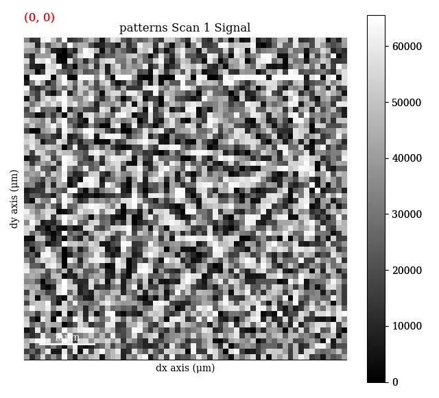

=====================
Background correction
=====================

The raw EBSD signal can be empirically evaluated as a superposition of a Kikuchi
diffraction pattern and a smooth background intensity. For pattern indexing, the
latter intensity is undesirable, while for so-called :doc:`virtual backscatter
electron (VBSE) imaging <virtual_backscatter_electron_imaging>`, this
intensity can reveal important topographical, compositional or diffraction
contrast. This section details methods to enhance the Kikuchi diffraction
pattern.

.. _static-background-correction:

Static background correction
============================

The slowly varying diffuse background in raw patterns can be removed by either
subtracting or dividing by a static background via
:meth:`~kikuchipy.signals.ebsd.EBSD.static_background_correction`:

.. code-block:: python

    >>> s.static_background_correction(operation='subtract', relative=True)

.. _fig-static-background-correction:

.. figure:: _static/image/background_correction/static_correction.jpg
    :align: center
    :width: 100%

    The same pattern as acquired (left) and after static background correction
    (right).

Here the static background pattern is assumed to be stored as part of the signal
``metadata``, which can be loaded via
:meth:`~kikuchipy.signals.ebsd.EBSD.set_experimental_parameters`. The static
background pattern can also be passed to the ``static_bg`` parameter. Passing
``relative=True`` ensures that relative intensities between patterns are kept
when the patterns are scaled after correction to fill the intensity range
available for the data type, e.g. [0, 255] for ``uint8``.

.. _dynamic-background-correction:

Dynamic background correction
=============================

Uneven intensity in a static background subtracted pattern can be corrected by
subtracting or dividing by a dynamic background obtained by Gaussian blurring.
This so-called flat fielding is done with
:meth:`~kikuchipy.signals.ebsd.EBSD.dynamic_background_correction`, with
possibilities of setting the ``operation`` and standard deviation of the
Gaussian kernel, ``sigma``:

.. code-block:: python

    >>> s.dynamic_background_correction(operation='subtract', sigma=2)

.. _fig-dynamic-background-correction:

.. figure:: _static/image/background_correction/dynamic_correction.jpg
    :align: center
    :width: 100%

    The same pattern after static correction (left) followed by dynamic
    background correction (right).

Patterns are rescaled to fill the available data type range.

.. _adaptive-histogram-equalization:

Adaptive histogram equalization
===============================

Enhancing the pattern contrast with adaptive histogram equalization has been
found useful when comparing patterns for dictionary indexing [Marquardt2017]_.
With :meth:`~kikuchipy.signals.ebsd.EBSD.adaptive_histogram_equalization`, the
intensities in the pattern histogram are spread to cover the available range,
e.g. [0, 255] for patterns of ``uint8`` data type:

.. code-block:: python

    >>> s.adaptive_histogram_equalization(kernel_size=(15, 15))

.. _fig-adapthist:

.. figure:: _static/image/background_correction/adapthist.jpg
    :align: center
    :width: 100%

    The same pattern after dynamic correction (left) followed by adaptive
    histogram equalization (right).

The ``kernel_size`` parameter determines the size of the contextual regions. See
e.g. Fig. 5 in [Jackson2019]_, also available via `EMsoft's GitHub repository
wiki
<https://github.com/EMsoft-org/EMsoft/wiki/DItutorial#52-determination-of-pattern-pre-processing-parameters>`_,
for the effect of varying ``kernel_size``.

.. [Marquardt2017]
    K. Marquardt, M. De Graef, S. Singh, H. Marquardt, A. Rosenthal,
    S. Koizuimi, "Quantitative electron backscatter diffraction (EBSD) data
    analyses using the dictionary indexing (DI) approach: Overcoming indexing
    difficulties on geological materials," *American Mineralogist* **102**
    (2017), doi: https://doi.org/10.2138/am-2017-6062.

.. [Jackson2019]
    M. A. Jackson, E. Pascal, M. De Graef, "Dictionary Indexing of Electron
    Back-Scatter Diffraction Patterns: a Hands-On Tutorial," *Integrating
    Materials and Manufacturing Innovation* **8** (2019), doi:
    https://doi.org/10.1007/s40192-019-00137-4.

.. _rescale-intensities:

Rescale intensities
===================

Only changing the data type using
:meth:`~kikuchipy.signals.ebsd.EBSD.change_dtype` does not rescale pattern
intensities, leading to patterns not using the full available data type range,
e.g. [0, 65535] for ``uint16``:

.. code-block:: python

    >>> print(s.data.dtype, s.data.max())
    uint8 255
    >>> s.change_dtype(np.uint16)
    >>> print(s.data.dtype, s.data.max())
    uint16 255
    >>> s.plot(vmax=1000)

.. _fig-pattern-adapthist-uint16:

.. figure:: _static/image/background_correction/pattern_adapthist_uint16.jpg
    :align: center
    :width: 350

    A pattern, initially with ``uint8`` data type, cast to ``uint16``.

In these cases it is convenient to rescale intensities to a desired data type
range, either keeping relative intensities between patterns or not, by using
:meth:`~kikuchipy.signals.ebsd.EBSD.rescale_intensities`:

.. code-block:: python

    >>> s.rescale_intensities(relative=True)
    >>> print(s.data.dtype, s.data.max())
    uint16 65535
    >>> s.plot(vmax=65535)

.. _fig-pattern-adapthist-uint16-rescaled:

    Same pattern as in :ref:`the above figure <fig-pattern-adapthist-uint16>` with
    intensities rescaled to fill the full ``uint16`` data range.
