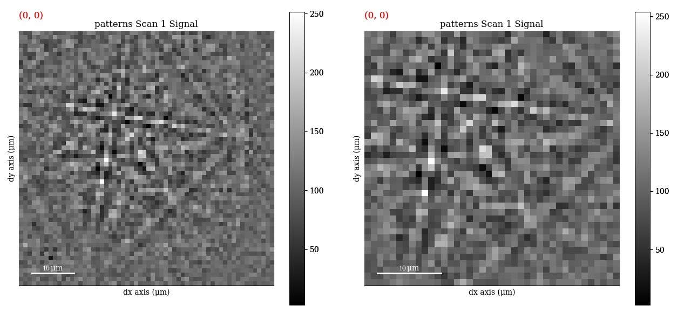

============================
Change scan and pattern size
============================

Patterns in an :class:`~kikuchipy.signals.ebsd.EBSD` object ``s`` are stored in
the ``s.data`` attribute as either :py:class:`numpy.ndarray` or
:class:`dask.array.Array`. `HyperSpy's user guide <http://hyperspy.org/
hyperspy-doc/current/user_guide/tools.html#indexing>`_ explains how to access,
i.e. index, the data. This section details example uses of scan and pattern
indexing specific to :class:`~kikuchipy.signals.ebsd.EBSD` objects.

.. _crop-scan-pattern:

Crop scan or pattern
====================

A new :class:`~kikuchipy.signals.ebsd.EBSD` object ``s2`` can be created from a
region of interest in another :class:`~kikuchipy.signals.ebsd.EBSD` object ``s``
by using HyperSpy's navigation indexing method ``inav``. The new scan keeps the
``metadata`` and ``original_metadata`` of ``s``. Say we, after plotting and
inspecting the data, want to create a new, smaller data set of the patterns
within a rectangle defined by the upper left pattern with index ``(53, 82)`` and
the bottom right pattern with index ``(74, 105)``:

.. code-block:: python

    >>> s
    <EBSD, title: , dimensions: (200, 149|60, 60)>
    >>> s2 = s.inav[53:74, 82:105]
    >>> s2
    <EBSD, title: , dimensions: (21, 23|60, 60)>

Patterns can also be cropped with the signal indexing method ``isig``. Say we
wanted to remove the ten outermost pixels in our (60 x 60) pixel patterns:

.. code-block:: python

    >>> s3 = s.isig[10:50, 10:50]
    >>> s3
    <EBSD, title: , dimensions: (200, 149|40, 40)>

    The same pattern in scan ``s`` before cropping (left) and in scan ``s3``
    after cropping (right).

.. _binning:

Binning
=======

A new signal with patterns binned e.g. by 2 can be obtained using the
:meth:`~kikuchipy.signals.ebsd.EBSD.rebin` method provided by HyperSpy,
explained further in `their user guide
<http://hyperspy.org/hyperspy-doc/current/user_guide/tools.html#rebinning>`_, by
passing in either the ``scale`` or ``new_shape`` parameter:

.. code-block:: python

    >>> print(s, s.data.dtype)
    <EBSD, title: , dimensions: (200, 149|60, 60)> uint8
    >>> s3 = s.rebin(scale=(1, 1, 2, 2))
    >>> print(s3, s.data.dtype)
    <EBSD, title: , dimensions: (200, 149|30, 30)> uint64

Note that :meth:`~kikuchipy-signals.ebsd.EBSD.rebin` casts the data to
``uint64``. This means that in this example, each pixel in the binned scan
``s3`` takes up eight times the memory size of pixels in the original scan
``s``.
