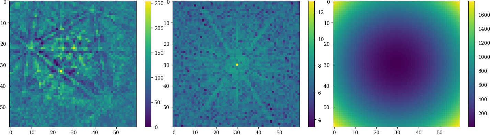
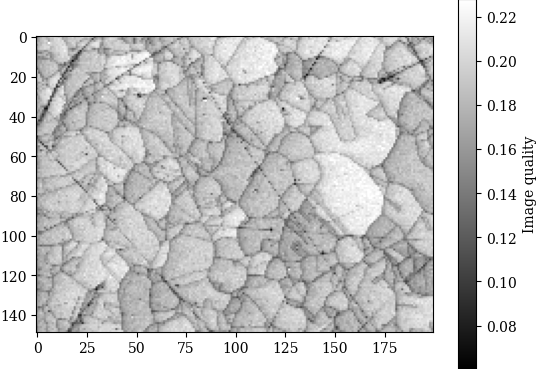

============
Feature maps
============

This section details methods for extracting information from pattern
intensities, called feature maps (for lack of a better description).

.. _image-quality:

Image quality
=============

The image quality metric :math:`Q` presented by Krieger Lassen [Lassen1994]_
can be calculated for an :class:`~kikuchipy.signals.EBSD` object with
:meth:`~kikuchipy.signals.EBSD.get_image_quality`, or, for a single pattern
(:class:`numpy.ndarray`), with :func:`~kikuchipy.pattern.get_image_quality`.
Following the notation in [Marquardt2017]_, it is given by

.. math::

    \begin{align}
    Q &= 1 - \frac{J}{J_{\mathrm{res}}w_{\mathrm{tot}}},\\
    J &= \sum_{h = -N/2}^{N/2} \sum_{k = -N/2}^{N/2} w(h, k)
    \left|\mathbf{q}\right|^2,\\
    J_{\mathrm{res}} &= \frac{1}{N^2} \sum_{h = -N/2}^{N/2}
    \sum_{k = -N/2}^{N/2} \left|\mathbf{q}\right|^2,\\
    w_{\mathrm{tot}} &= \sum_{h = -N/2}^{N/2} \sum_{k = -N/2}^{N/2} w(h, k).
    \end{align}

The function :math:`w(h, k)` is the Fast Fourier Transform (FFT) power spectrum
of the EBSD pattern, and the vectors :math:`\mathbf{q}` are the frequency
vectors with components :math:`(h, k)`. The sharper the Kikuchi bands, the
greater the high frequency content of the power spectrum, and thus the closer
:math:`Q` will be to unity. To visualize parts of the computation, we compute
the power spectrum of a pattern in an :class:`~kikuchipy.signals.EBSD` object
``s`` and the frequency vectors, shift the zero-frequency components to the
centre, and plot them:

.. code-block::

    >>> import kikuchipy as kp
    >>> import matplotlib.pyplot as plt
    >>> import numpy as np

    >>> p = s.inav[0, 0].data
    >>> plt.figure()
    >>> plt.imshow(p)
    >>> plt.colorbar()

    >>> p_fft = kp.pattern.fft(p, shift=True)
    >>> plt.figure()
    >>> plt.imshow(np.log(kp.pattern.fft_spectrum(p_fft)))
    >>> plt.colorbar()

    >>> q = kp.util.pattern.fft_frequency_vectors(shape=p.shape)
    >>> plt.figure()
    >>> plt.imshow(np.fft.fftshift(q))
    >>> plt.colorbar()

.. _fig-image-quality-pattern:

    A background corrected EBSD pattern (left), the logarithm of the shifted
    power spectrum :math:`w(h, k)` of its FFT (middle), and the shifted
    frequency vectors :math:`\mathbf{q}` (right).

If we *don't* want the EBSD patterns to be
:ref:`zero-mean normalized <normalize-intensity>` before computing :math:`Q`,
we must pass ``normalized=False``. Let's compute the image quality :math:`Q` and
plot it for a Nickel data set from [Anes2019]_:

.. code-block::

    >>> iq = s.get_image_quality(normalize=True)  # Default
    >>> plt.figure()
    >>> plt.imshow(iq)
    >>> plt.colorbar()

.. _fig-image-quality-map:

    The image quality map of a Nickel data set from [Anes2019]_.

If we want to use this map to navigate around in when plotting patterns, we can
easily do that as explained in the
:doc:`visualizing patterns <visualizing_patterns>` guide.
