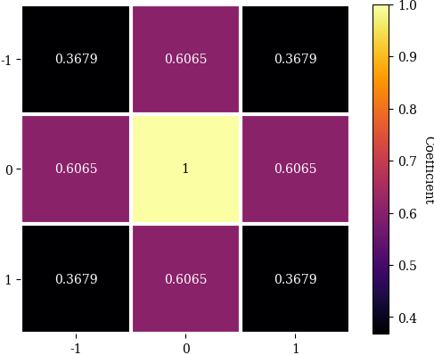

==================
Pattern processing
==================

The raw EBSD signal can be empirically evaluated as a superposition of a Kikuchi
diffraction pattern and a smooth background intensity. For pattern indexing, the
latter intensity is usually undesirable, while for :doc:`virtual backscatter
electron (VBSE) imaging <virtual_backscatter_electron_imaging>`, this intensity
can reveal topographical, compositional or diffraction contrast. This section
details methods to enhance the Kikuchi diffraction pattern and manipulate
detector intensities in patterns in an :class:`~kikuchipy.signals.ebsd.EBSD`
object.

.. note::

    The functions operating on individual patterns (:class:`numpy.ndarray`) are
    available in the :mod:`kikuchipy.util.pattern` module when possible.

.. _rescale-intensity:

Rescale intensity
=================

Vendors usually write patterns to file with 8 (``uint8``) or 16 (``uint16``) bit
integer depth, holding [0, 2^8] or [0, 2^16] gray levels, respectively. To avoid
loosing intensity information when processing, we often change data types to
e.g. 32 bit floating point (``float32``). However, only changing the data type
with :meth:`~hyperspy.signal.BaseSignal.change_dtype` does not rescale pattern
intensities, leading to patterns not using the full available data type range:

.. code-block::

    >>> print(s.data.dtype, s.data.max())
    uint8 255
    >>> s.change_dtype(np.uint16)
    >>> print(s.data.dtype, s.data.max())
    uint16 255
    >>> s.plot(vmax=1000)

In these cases it is convenient to rescale intensities to a desired data type
range, either keeping relative intensities between patterns in a scan or not. We
can do this for all patterns in a scan (:class:`~kikuchipy.signals.ebsd.EBSD`
object) with :meth:`kikuchipy.signals.ebsd.EBSD.rescale_intensity`:

.. code-block::

    >>> s.rescale_intensity(relative=True)
    >>> print(s.data.dtype, s.data.max())
    uint16 65535
    >>> s.plot(vmax=65535)

Or, we can do it for a single pattern (:class:`numpy.ndarray`) with
:func:`kikuchipy.util.pattern.rescale_intensity`:

.. code-block::

    >>> p = s.inav[0, 0].data
    >>> p2 = kp.util.pattern.rescale_intensity(p)

.. _fig-rescale-intensities:

.. figure:: _static/image/pattern_processing/rescale_intensities.jpg
    :align: center
    :width: 100%

    A pattern, initially with ``uint8`` data type, cast to ``uint16`` (left),
    with intensities not filling the available gray levels (left). The same
    pattern after rescaling (right).

We can also stretch the pattern contrast by removing intensities outside a range
passed to ``in_range`` or at certain percentiles by passing percents to
``percentiles``:

.. code-block::

    >>> s.rescale_intensity(in_range=(5, 250))
    >>> print(s.data.min(), s.data.max())
    5 250
    >>> s.rescale_intensity(percentiles=(0.5, 99.5))
    >>> print(s.data.min(), s.data.max())
    0 255

.. _fig-contrast-stretching:

.. figure:: _static/image/pattern_processing/contrast_stretching.jpg
    :align: center
    :width: 100%

    A pattern before (left) and after (right) stretching its contrast to a range
    given by the lowest 0.5% and highest 0.5% intensities.

This can reduce the influence of outliers with exceptionally high or low
intensities, like hot or dead pixels.

.. _normalize-intensity:

Normalize intensity
===================

It can be useful to normalize pattern intensities to a mean value of
:math:`\mu = 0.0` and a standard deviation of e.g. :math:`\sigma = 1.0` when
e.g. comparing patterns or calculating :ref:`image quality <image-quality>`.
This can be

.. _background-correction:

Background correction
=====================

.. _remove-static-background:

Remove the static background
----------------------------

Effects which are constant, like hot pixels or dirt on the detector, can be
removed by either subtracting or dividing by a static background via
:meth:`~kikuchipy.signals.ebsd.EBSD.static_background_correction`:

.. code-block:: python

    >>> s.static_background_correction(operation='subtract', relative=True)

.. _fig-static-background-correction:

.. figure:: _static/image/pattern_processing/static_correction.jpg
    :align: center
    :width: 100%

    The same pattern as acquired (left) and after static background correction
    (right).

Here the static background pattern is assumed to be stored as part of the signal
``metadata``, which can be loaded via
:meth:`~kikuchipy.signals.ebsd.EBSD.set_experimental_parameters`. The static
background pattern can also be passed to the ``static_bg`` parameter. Passing
``relative=True`` (default) ensures that relative intensities between patterns
are kept when they are rescaled after correction to fill the available data
range. In this case, for a scan of data type ``uint8`` with data range [0, 255],
the highest pixel intensity in a scan is stretched to 255 (and the lowest to 0),
while the rest is rescaled keeping relative intensities between patterns. With
``relative=False``, all patterns are equally stretched to [0, 255].

.. _remove-dynamic-background:

Remove the dynamic background
-----------------------------

Uneven intensity in a static background subtracted pattern can be corrected by
subtracting or dividing by a dynamic background obtained by Gaussian blurring.
This so-called flat fielding is done with
:meth:`~kikuchipy.signals.ebsd.EBSD.dynamic_background_correction`, with
possibilities of setting the ``operation`` and standard deviation of the
Gaussian kernel, ``sigma``:

.. code-block:: python

    >>> s.dynamic_background_correction(operation='subtract', sigma=2)

.. _fig-dynamic-background-correction:

.. figure:: _static/image/pattern_processing/dynamic_correction.jpg
    :align: center
    :width: 100%

    The same pattern after static correction (left) followed by dynamic
    background correction (right).

Patterns are rescaled to fill the available data type range.

.. _get-dynamic-background:

Get the dynamic background
==========================

.. _pattern-averaging:

Average neighbour patterns
==========================

The signal-to-noise ratio in patterns in an EBSD scan ``s`` can be improved by
averaging patterns with their closest neighbours within a kernel or mask with
:meth:`~kikuchipy.signals.ebsd.EBSD.average_neighbour_patterns`:

.. code-block:: python

    >>> s.average_neighbour_patterns(
            kernel="gaussian", kernel_size=(3, 3), std=1)

.. _fig-average-neighbour-patterns:

.. figure:: _static/image/pattern_processing/average_neighbour_pattern.jpg
    :align: center
    :width: 100%

    An example pattern before (left) and after (right) averaging with the
    nearest neighbour patterns in a (3 x 3) Gaussian kernel with :math:`\sigma`
    = 1.

The array of averaged patterns :math:`g(n_{\mathrm{x}}, n_{\mathrm{y}})` is
obtained by spatially correlating a kernel :math:`w(s, t)` with the array of
patterns :math:`f(n_{\mathrm{x}}, n_{\mathrm{y}})`, here 4D, which is padded
with zeros at the edges. As coordinates :math:`n_{\mathrm{x}}` and
:math:`n_{\mathrm{y}}` are varied, the kernel origin moves from pattern to
pattern, computing the sum of products of the kernel coefficients with the
neighbour pattern intensities, defined by the kernel size, followed by
normalising by the sum of the kernel coefficients. For a symmetrical kernel of
size :math:`m \times n`, this becomes [Gonzalez2017]_

.. math::

    g(n_{\mathrm{x}}, n_{\mathrm{y}}) =
    \frac{\sum_{s=-a}^a\sum_{t=-b}^b{w(s, t)
    f(n_{\mathrm{x}} + s, n_{\mathrm{y}} + t)}}
    {\sum_{s=-a}^a\sum_{t=-b}^b{w(s, t)}},

where :math:`a = (m - 1)/2` and :math:`b = (n - 1)/2`. The kernel :math:`w`, a
:class:`~kikuchipy.util.kernel.Kernel` object, can be plotted:

.. code-block:: python

    >>> w = kp.util.Kernel(kernel="gaussian", kernel_size=(3, 3), std=1)
    >>> w.plot(cmap="inferno")

.. _fig-averaging-kernel:

    A Gaussian averaging kernel with :math:`\sigma` = 1 and the origin in the
    kernel centre.

Any 1D or 2D kernel with desired coefficients can be used. This custom kernel
can be passed to the ``kernel`` parameter in
:meth:`~kikuchipy.signals.ebsd.EBSD.average_neighbour_patterns` or
:class:`~kikuchipy.util.kernel.Kernel` as a :class:`numpy.ndarray` or
:class:`dask.array.Array`. Additionally, any kernel listed in
:func:`scipy.signal.windows.get_window` passed as a string via ``kernel`` with
the necessary parameters as keyword arguments (like ``std=1`` for
``kernel="gaussian"``) can be used. To demonstrate the creation and use of an
asymmetrical circular kernel (and the use of
:meth:`~kikuchipy.util.kernel.Kernel.make_circular`, although we could create a
circular kernel directly by calling ``kernel="circular"`` upon kernel
initialization):

.. code-block:: python

    >>> w = kp.util.Kernel(kernel="rectangular", kernel_size=(5, 4))
    >>> w
    rectangular, (5, 4)
    >>> w.coefficients
    array([[1., 1., 1., 1.],
       [1., 1., 1., 1.],
       [1., 1., 1., 1.],
       [1., 1., 1., 1.],
       [1., 1., 1., 1.]])
    >>> w.make_circular()
    >>> w
    circular, (5, 4)
    >>> s.average_neighbour_patterns(w)
    >>> w.plot()

    A circular averaging kernel. Note the location of the origin (0, 0).

.. note::

    Neighbour pattern averaging increases the virtual interaction volume of the
    electron beam with the sample, leading to a potential loss in spatial
    resolution. Averaging may in some cases, like on grain boundaries, mix two
    or more different diffraction patterns, which might be unwanted. See
    [Wright2015]_ for a discussion of this concern.

.. [Wright2015]
    S. I. Wright, M. M. Nowell, S. P. Lindeman, P. P. Camus, M. De Graef, M. A.
    Jackson, "Introduction and comparison of new EBSD post-processing
    methodologies," *Ultramicroscopy* **159** (2015), doi:
    https://doi.org/10.1016/j.ultramic.2015.08.001.

.. _adaptive-histogram-equalization:

Adaptive histogram equalization
===============================

Enhancing the pattern contrast with adaptive histogram equalization has been
found useful when comparing patterns for dictionary indexing [Marquardt2017]_.
With :meth:`~kikuchipy.signals.ebsd.EBSD.adaptive_histogram_equalization`, the
intensities in the pattern histogram are spread to cover the available range,
e.g. [0, 255] for patterns of ``uint8`` data type:

.. code-block:: python

    >>> s.adaptive_histogram_equalization(kernel_size=(15, 15))

.. _fig-adapthist:

.. figure:: _static/image/pattern_processing/adapthist.jpg
    :align: center
    :width: 100%

    The same pattern after dynamic correction (left) followed by adaptive
    histogram equalization (right).

The ``kernel_size`` parameter determines the size of the contextual regions. See
e.g. Fig. 5 in [Jackson2019]_, also available via `EMsoft's GitHub repository
wiki
<https://github.com/EMsoft-org/EMsoft/wiki/DItutorial#52-determination-of-pattern-pre-processing-parameters>`_,
for the effect of varying ``kernel_size``.

.. [Marquardt2017]
    K. Marquardt, M. De Graef, S. Singh, H. Marquardt, A. Rosenthal,
    S. Koizuimi, "Quantitative electron backscatter diffraction (EBSD) data
    analyses using the dictionary indexing (DI) approach: Overcoming indexing
    difficulties on geological materials," *American Mineralogist* **102**
    (2017), doi: https://doi.org/10.2138/am-2017-6062.

.. [Jackson2019]
    M. A. Jackson, E. Pascal, M. De Graef, "Dictionary Indexing of Electron
    Back-Scatter Diffraction Patterns: a Hands-On Tutorial," *Integrating
    Materials and Manufacturing Innovation* **8** (2019), doi:
    https://doi.org/10.1007/s40192-019-00137-4.

.. _fft-filtering:

Filtering in the frequency domain
=================================
