==================
Pattern processing
==================

The raw EBSD signal can be empirically evaluated as a superposition of a Kikuchi
diffraction pattern and a smooth background intensity. For pattern indexing, the
latter intensity is usually undesirable, while for :doc:`virtual backscatter
electron (VBSE) imaging <virtual_backscatter_electron_imaging>`, this intensity
can reveal topographical, compositional or diffraction contrast. This section
details methods to enhance the Kikuchi diffraction pattern and manipulate
detector intensities in patterns in an :class:`~kikuchipy.signals.EBSD` object.

Most of the methods operating on EBSD objects use functions that operate on the
individual patterns (:class:`numpy.ndarray`). These single pattern functions are
available in the :mod:`kikuchipy.pattern` module.

Almost all methods operate inplace (indicated in their docstrings), meaning it
overwrites the patterns in the EBSD object. If a new object is desired, create a
:meth:`~hyperspy.signal.BaseSignal.deepcopy` of the original object and perform
the operation on this:

.. code-block::

    >>> s2 = s.deepcopy()
    >>> s2.remove_static_background()

.. _rescale-intensity:

Rescale intensity
=================

Vendors usually write patterns to file with 8 (``uint8``) or 16 (``uint16``) bit
integer depth, holding [0, 2^8] or [0, 2^16] gray levels, respectively. To avoid
loosing intensity information when processing, we often change data types to
e.g. 32 bit floating point (``float32``). However, only changing the data type
with :meth:`~hyperspy.signal.BaseSignal.change_dtype` does not rescale pattern
intensities, leading to patterns not using the full available data type range:

.. code-block::

    >>> print(s.data.dtype, s.data.max())
    uint8 255
    >>> s.change_dtype(np.uint16)
    >>> print(s.data.dtype, s.data.max())
    uint16 255
    >>> s.plot(vmax=1000)

In these cases it is convenient to rescale intensities to a desired data type
range, either keeping relative intensities between patterns in a scan or not. We
can do this for all patterns in a scan (:class:`~kikuchipy.signals.EBSD`
object) with :meth:`kikuchipy.signals.EBSD.rescale_intensity`:

.. code-block::

    >>> s.rescale_intensity(relative=True)
    >>> print(s.data.dtype, s.data.max())
    uint16 65535
    >>> s.plot(vmax=65535)

Or, we can do it for a single pattern (:class:`numpy.ndarray`) with
:func:`kikuchipy.pattern.rescale_intensity`:

.. code-block::

    >>> p = s.inav[0, 0].data
    >>> p2 = kp.pattern.rescale_intensity(p)

.. _fig-rescale-intensities:

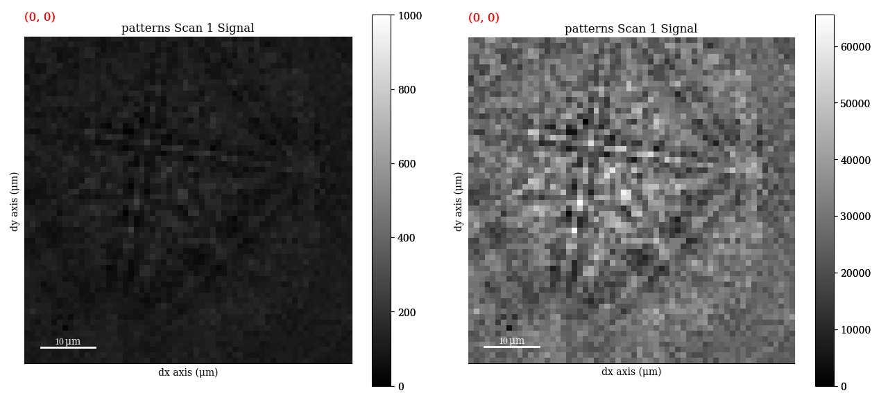

    A pattern, initially with ``uint8`` data type, cast to ``uint16`` (left),
    with intensities not filling the available gray levels (left). The same
    pattern after rescaling (right).

We can also stretch the pattern contrast by removing intensities outside a range
passed to ``in_range`` or at certain percentiles by passing percents to
``percentiles``:

.. code-block::

    >>> s.rescale_intensity(in_range=(5, 250))
    >>> print(s.data.min(), s.data.max())
    5 250
    >>> s.rescale_intensity(percentiles=(0.5, 99.5))
    >>> print(s.data.min(), s.data.max())
    0 255

.. _fig-contrast-stretching:

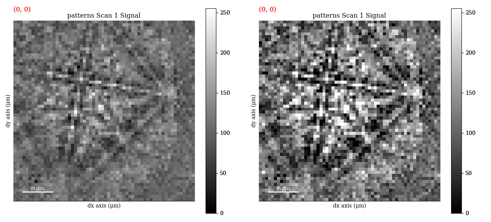

    A pattern before (left) and after (right) stretching its contrast to a range
    given by the lowest 0.5% and highest 0.5% intensities.

This can reduce the influence of outliers with exceptionally high or low
intensities, like hot or dead pixels.

.. _normalize-intensity:

Normalize intensity
===================

It can be useful to normalize pattern intensities to a mean value of
:math:`\mu = 0.0` and a standard deviation of e.g. :math:`\sigma = 1.0` when
e.g. comparing patterns or calculating the :ref:`image quality <image-quality>`.
Patterns can be normalized with
:meth:`~kikuchipy.signals.EBSD.normalize_intensity`:

.. code-block::

    >>> np.mean(s.data)
    146.0670987654321
    >>> s.change_dtype(np.float32)  # Or passing dtype_out=np.float32 to s.no...
    >>> s.normalize_intensity(num_std=1)  # Default
    >>> np.mean(s.data)
    2.6373216e-08

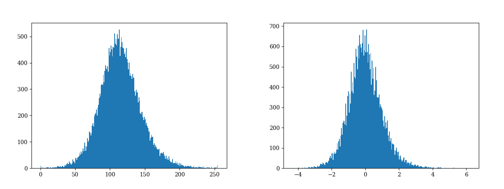

    Histogram of pattern intensities in a scan before normalization (left) and
    after normalization (right).

.. _background-correction:

Background correction
=====================

.. _remove-static-background:

Remove the static background
----------------------------

Effects which are constant, like hot pixels or dirt on the detector, can be
removed by either subtracting or dividing by a static background via
:meth:`~kikuchipy.signals.EBSD.remove_static_background`:

.. code-block::

    >>> s.remove_static_background(operation='subtract', relative=True)

.. _fig-static-background-correction:

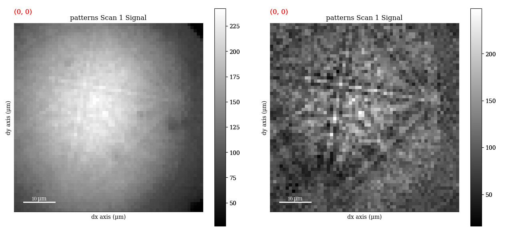

    The same pattern as acquired (left) and after removing the static background
    (right).

Here, the static background pattern is assumed to be stored as part of the
signal ``metadata``, which can be loaded via
:meth:`~kikuchipy.signals.EBSD.set_experimental_parameters`. The static
background pattern can also be passed to the ``static_bg`` parameter. Passing
``relative=True`` (default) ensures that relative intensities between patterns
are kept when they are rescaled after correction to fill the available data
range. In this case, for a scan of data type ``uint8`` with data range [0, 255],
the highest pixel intensity in a scan is stretched to 255 (and the lowest to 0),
while the rest is rescaled keeping relative intensities between patterns. With
``relative=False``, all patterns are stretched to [0, 255].

The static background pattern intensities can be rescaled to each individual
pattern's intensity range before removal by passing ``scale_bg=True``, which
will result in the relative intensity between patterns to be lost (passing
``relative=True`` along with ``scale_bg=True`` is not allowed).

.. _remove-dynamic-background:

Remove the dynamic background
-----------------------------

Uneven intensity in a static background subtracted pattern can be corrected by
subtracting or dividing by a dynamic background obtained by Gaussian blurring.
This so-called flat fielding is done with
:meth:`~kikuchipy.signals.EBSD.remove_dynamic_background`. A Gaussian
window with a standard deviation set by ``std`` is used to blur each pattern
individually (dynamic) either in the spatial or frequency domain, set by
``filter_domain``. Blurring in the frequency domain is effectively accomplished
by a low-pass :ref:`Fast Fourier Transform (FFT) filter <fft-filtering>`. The
individual Gaussian blurred dynamic backgrounds are then subtracted or divided
from the respective patterns, set by ``operation``:

.. code-block::

    >>> s.remove_dynamic_background(
    ...     operation='subtract',  # Default
    ...     filter_domain="frequency",  # Default
    ...     std=8,  # Default is 1/8 of pattern width
    ...     truncate=4.0  # Default
    ... )

.. _fig-dynamic-background-correction:

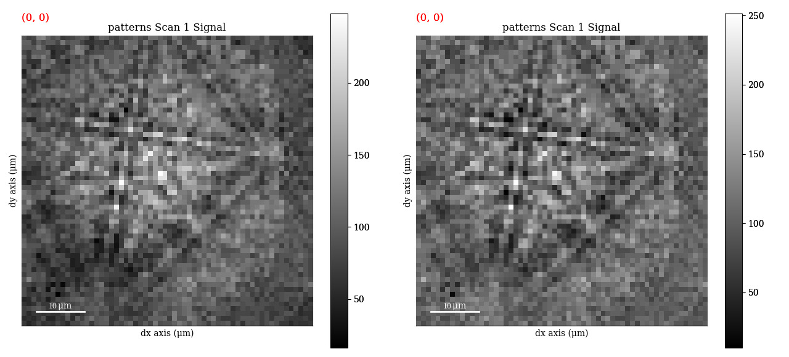

    The same pattern after removal of the static background (left), followed by
    removing the dynamic background pattern produced by Gaussian blurring in the
    frequency domain (right).

The width of the Gaussian window is truncated at the ``truncated`` number of
standard deviations. Output patterns are rescaled to fill the input patterns'
data type range.

.. _get-dynamic-background:

Get the dynamic background
==========================

The Gaussian blurred pattern removed during dynamic background correction can
be obtained as it's own :class:`~kikuchipy.signals.EBSD` object:

.. code-block::

    >>> s
    <EBSD, title: patterns Scan 1, dimensions: (3, 3|60, 60)>
    >>> bg = s.get_dynamic_background(
    ...     filter_domain="frequency",
    ...     std=8,
    ...     truncate=4,
    ... )
    >>> bg
    <EBSD, title: , dimensions: (3, 3|60, 60)>

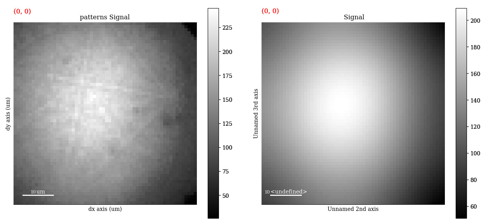

    The pattern as acquired (left) and the same pattern after Gaussian blurring
    in the frequency domain, showing only the large scale variations and no
    Kikuchi pattern features.

.. _pattern-averaging:

Average neighbour patterns
==========================

The signal-to-noise ratio in patterns in an EBSD scan ``s`` can be improved by
averaging patterns with their closest neighbours within a window/kernel/mask
with :meth:`~kikuchipy.signals.EBSD.average_neighbour_patterns`:

.. code-block::

    >>> s.average_neighbour_patterns(window="gaussian", shape=(3, 3), std=1)

.. _fig-average-neighbour-patterns:

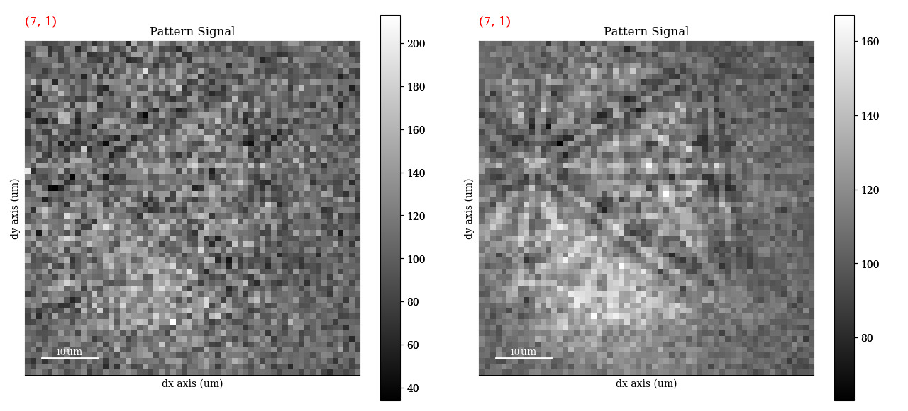

    An example pattern before (left) and after (right) averaging with the
    nearest neighbour patterns in a (3 x 3) Gaussian window with :math:`\sigma`
    = 1.

The array of averaged patterns :math:`g(n_{\mathrm{x}}, n_{\mathrm{y}})` is
obtained by spatially correlating a window :math:`w(s, t)` with the array of
patterns :math:`f(n_{\mathrm{x}}, n_{\mathrm{y}})`, here 4D, which is padded
with zeros at the edges. As coordinates :math:`n_{\mathrm{x}}` and
:math:`n_{\mathrm{y}}` are varied, the window origin moves from pattern to
pattern, computing the sum of products of the window coefficients with the
neighbour pattern intensities, defined by the window shape, followed by
normalizing by the sum of the window coefficients. For a symmetrical window of
shape :math:`m \times n`, this becomes [Gonzalez2017]_

.. math::

    g(n_{\mathrm{x}}, n_{\mathrm{y}}) =
    \frac{\sum_{s=-a}^a\sum_{t=-b}^b{w(s, t)
    f(n_{\mathrm{x}} + s, n_{\mathrm{y}} + t)}}
    {\sum_{s=-a}^a\sum_{t=-b}^b{w(s, t)}},

where :math:`a = (m - 1)/2` and :math:`b = (n - 1)/2`. The window :math:`w`, a
:class:`~kikuchipy.filters.Window` object, can be plotted:

.. code-block::

    >>> w = kp.filters.Window(window="gaussian", shape=(3, 3), std=1)
    >>> w.plot(cmap="inferno")

.. _fig-averaging-window:

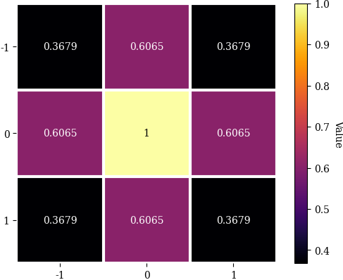

    A Gaussian averaging window with :math:`\sigma` = 1 and the origin in the
    window centre.

Any 1D or 2D window with desired coefficients can be used. This custom window
can be passed to the ``window`` parameter in
:meth:`~kikuchipy.signals.EBSD.average_neighbour_patterns` or
:class:`~kikuchipy.filters.Window` as a :class:`numpy.ndarray` or
:class:`dask.array.Array`. Additionally, any window in
:func:`scipy.signal.windows.get_window` passed as a string via ``window`` with
the necessary parameters as keyword arguments (like ``std=1`` for
``window="gaussian"``) can be used. To demonstrate the creation and use of an
asymmetrical circular window (and the use of
:meth:`~kikuchipy.filters.Window.make_circular`, although we could create a
circular window directly by calling ``window="circular"`` upon window
initialization):

.. code-block::

    >>> w = kp.filters.Window(window="rectangular", shape=(5, 4))
    >>> w
    Window (5, 4) rectangular
    [[1. 1. 1. 1.]
     [1. 1. 1. 1.]
     [1. 1. 1. 1.]
     [1. 1. 1. 1.]
     [1. 1. 1. 1.]]
    >>> w.make_circular()
    >>> w
    Window (5, 4) circular
    [[0. 0. 1. 0.]
     [0. 1. 1. 1.]
     [1. 1. 1. 1.]
     [0. 1. 1. 1.]
     [0. 0. 1. 0.]]
    >>> s.average_neighbour_patterns(w)
    >>> figure, image, colorbar = w.plot()

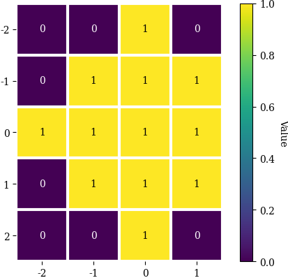

    A circular averaging window. Note the location of the origin (0, 0).

.. note::

    Neighbour pattern averaging increases the virtual interaction volume of the
    electron beam with the sample, leading to a potential loss in spatial
    resolution. Averaging may in some cases, like on grain boundaries, mix two
    or more different diffraction patterns, which might be unwanted. See
    [Wright2015]_ for a discussion of this concern.

.. [Wright2015]
    S. I. Wright, M. M. Nowell, S. P. Lindeman, P. P. Camus, M. De Graef, M. A.
    Jackson, "Introduction and comparison of new EBSD post-processing
    methodologies," *Ultramicroscopy* **159** (2015), doi:
    https://doi.org/10.1016/j.ultramic.2015.08.001.

.. _adaptive-histogram-equalization:

Adaptive histogram equalization
===============================

Enhancing the pattern contrast with adaptive histogram equalization has been
found useful when comparing patterns for dictionary indexing [Marquardt2017]_.
With :meth:`~kikuchipy.signals.EBSD.adaptive_histogram_equalization`, the
intensities in the pattern histogram are spread to cover the available range,
e.g. [0, 255] for patterns of ``uint8`` data type:

.. code-block:: python

    >>> s.adaptive_histogram_equalization(kernel_size=(15, 15))

.. _fig-adapthist:

.. figure:: _static/image/pattern_processing/adapthist.jpg
    :align: center
    :width: 100%

    The same pattern after dynamic correction (left) followed by adaptive
    histogram equalization (right).

The ``kernel_size`` parameter determines the size of the contextual regions. See
e.g. Fig. 5 in [Jackson2019]_, also available via `EMsoft's GitHub repository
wiki
<https://github.com/EMsoft-org/EMsoft/wiki/DItutorial#52-determination-of-pattern-pre-processing-parameters>`_,
for the effect of varying ``kernel_size``.

.. [Marquardt2017]
    K. Marquardt, M. De Graef, S. Singh, H. Marquardt, A. Rosenthal,
    S. Koizuimi, "Quantitative electron backscatter diffraction (EBSD) data
    analyses using the dictionary indexing (DI) approach: Overcoming indexing
    difficulties on geological materials," *American Mineralogist* **102**
    (2017), doi: https://doi.org/10.2138/am-2017-6062.

.. [Jackson2019]
    M. A. Jackson, E. Pascal, M. De Graef, "Dictionary Indexing of Electron
    Back-Scatter Diffraction Patterns: a Hands-On Tutorial," *Integrating
    Materials and Manufacturing Innovation* **8** (2019), doi:
    https://doi.org/10.1007/s40192-019-00137-4.

.. _fft-filtering:

Filtering in the frequency domain
=================================

Filtering of patterns in the frequency domain can be done with
:meth:`~kikuchipy.signals.EBSD.fft_filter`. This method takes a spatial
kernel defined in the spatial domain, or a transfer function defined in the
frequency domain, in the ``transfer_function`` argument as a
:class:`numpy.ndarray` or a :class:`~kikuchipy.filters.Window`. Which domain
the transfer function is defined in must be passed to the ``function_domain``
argument. Whether to shift zero-frequency components to the centre of the FFT
can also be controlled via ``shift``, but note that this is only used when
``function_domain="frequency"``.

Popular uses of filtering of EBSD patterns in the frequency domain include
removing large scale variations across the detector with a Gaussian high pass
filter, or removing high frequency noise with a Gaussian low pass filter. These
particular functions are readily available via
:class:`~kikuchipy.filters.Window`:

.. code-block::

    >>> pattern_shape = s.axes_manager.signal_shape[::-1]
    >>> w_low = kp.filters.Window(
    ...     "lowpass",
    ...     cutoff=22,
    ...     cutoff_width=10,
    ...     shape=pattern_shape
    ... )
    >>> w_high = kp.filters.Window(
    ...     "highpass",
    ...     cutoff=3,
    ...     cutoff_width=2,
    ...     shape=pattern_shape
    ... )
    >>> w = w_low * w_high
    >>> import matplotlib.pyplot as plt
    >>> plt.imshow(w)
    >>> plt.colorbar()
    >>> plt.figure()
    >>> plt.plot(w[pattern_shape[0] // 2:, :])

.. _fig-fft-filter-highlowpass:

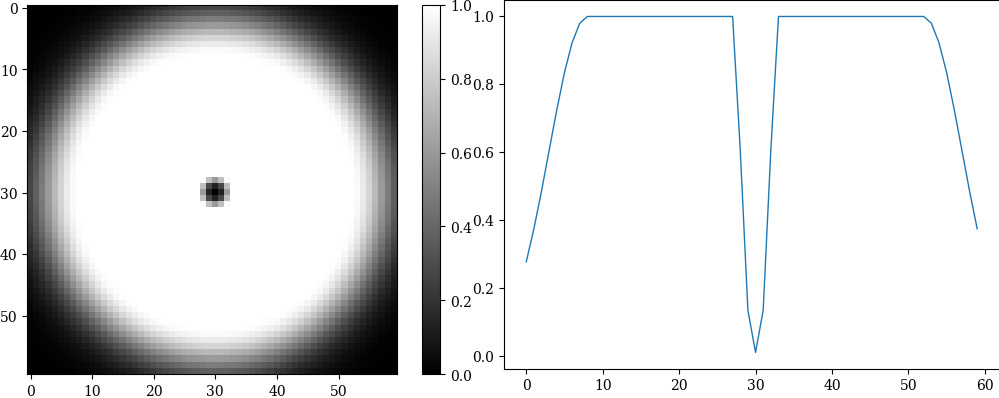

    The product of the combined high and low pass transfer functions defined in
    the frequency domain (left), and the intensity profile across its centre
    (right).

Then, to multiply the FFT of each pattern with this transfer function, and
subsequently computing the inverse FFT (IFFT), we use
:meth:`~kikuchipy.signals.EBSD.fft_filter`, and remember to shift the
zero-frequency components to the centre of the FFT:

.. code-block::

    >>> s.fft_filter(
    ...     transfer_function=w, function_domain="frequency", shift=True)

.. _fig-fft-filter-highlowpass-result:

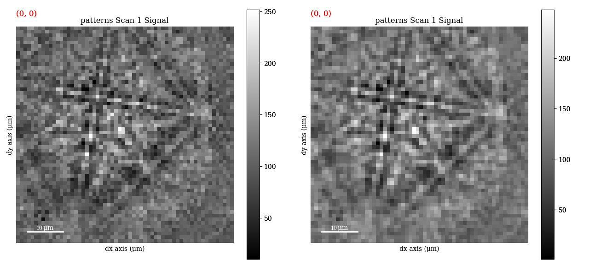

    The same pattern before (left) and after (right) filtering with a
    :ref:`combined high and low pass Gaussian transfer function
    <fig-fft-filter-highlowpass>`.

Note that filtering with a spatial kernel in the frequency domain, after
creating the kernel's transfer function via FFT, and computing the IFFT, is, in
this case, the same as spatially correlating the kernel with the pattern. Let's
demonstrate this by attempting to sharpen a pattern with a Laplacian kernel in
both the spatial and frequency domains and comparing the results (this is a
purely illustrative example, and perhaps not that practically useful):

.. code-block::

    >>> w_laplacian = np.array([[-1, -1, -1], [-1, 8, -1], [-1, -1, -1]])
    >>> p = s.inav[0, 0].deepcopy().data.astype(np.float32)
    >>> s.fft_filter(transfer_function=w_laplacian, function_domain="spatial")

    >>> from scipy.ndimage import correlate
    >>> p_filt = correlate(w, weights=w_laplacian)
    >>> p_filt_resc = kp.util.pattern.rescale_intensity(
    ...     p_filt, dtype_out=np.uint8)

.. _fig-fft-filter-laplacian:

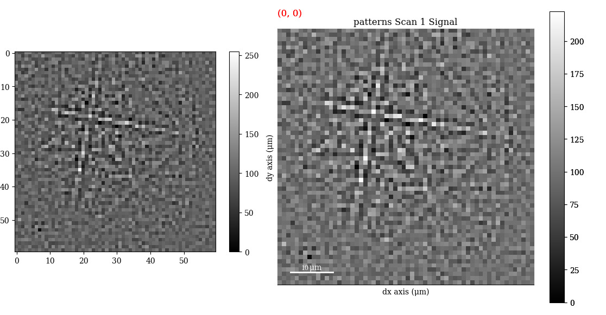

    The result of correlating a pattern with a Laplacian sharpening kernel
    (left). The exact same result is obtained by filtering in the frequency
    domain with the kernel's transfer function and subsequently computing the
    IFFT (right).

Note also that :meth:`~kikuchipy.signals.EBSD.fft_filter` performs the
filtering on the patterns with data type ``np.float32``, and therefore have to
rescale back to the pattern's original data type if necessary.
