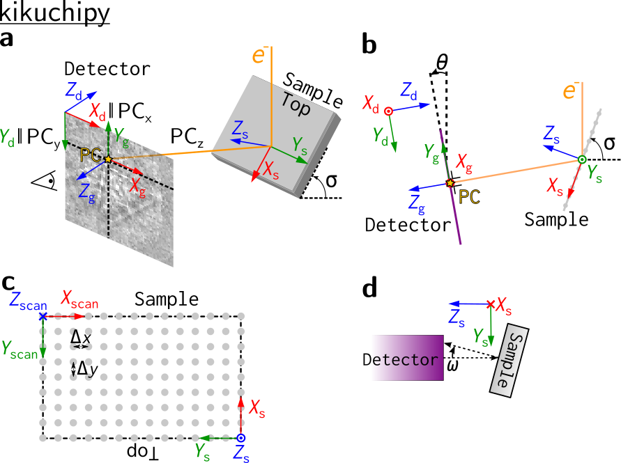
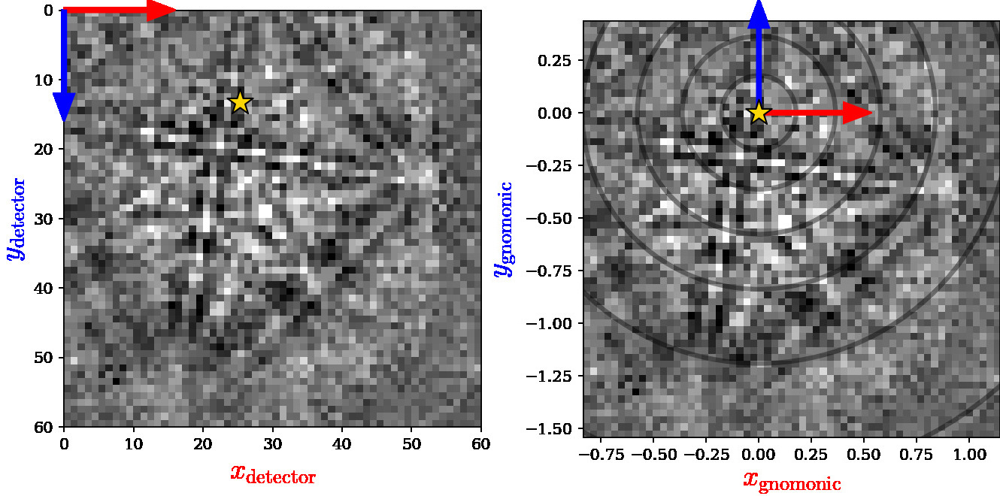

================
Reference frames
================

Sample-detector geometry
------------------------

:numref:`fig-detector-sample-geometry` and :numref:`fig-detector-coordinates`
show EBSD reference frames used in kikuchipy, all of which are right handed.
They are based on definitions presented in [Britton2016]_ and the accompanying
supplementary material.

.. _fig-detector-sample-geometry:

    **(a)** An EBSD experiment showing the orientation of the crystal reference
    frame, :math:`x_{euler}-y_{euler}-z_{euler}`, attached to the sample. The
    RD-TD-ND crystal reference frame used by EDAX TSL is shown for reference.
    An EBSD pattern on the detector screen is viewed from behind the screen
    towards the sample. **(b)** How the EBSD map appears within the data
    collection software, with the crystal reference frame and the scanning
    reference frame, :math:`x_{scan}-y_{scan}-z_{scan}`, attached. **(c)** The
    relationship between the crystal reference frame and the detector reference
    frame, :math:`x_{detector}-y_{detector}-z_{detector}`, with the projection
    center highlighted. The detector tilt :math:`\theta` and sample tilt
    :math:`\sigma`, in this case :math:`10^{\circ}` and :math:`70^{\circ}`,
    respectively, are also shown.

.. _fig-detector-coordinates:

    The EBSD pattern in :numref:`fig-detector-sample-geometry` (a) as viewed
    from behind the screen towards the sample (left), with the detector
    reference frame the same as in (c) with its origin (0, 0) in the upper left
    pixel. The detector pixels' gnomonic coordinates can be described with a
    calibrated projection center (PC) (right), with the gnomonic reference frame
    origin (0, 0) in (PC\ :sub:`x`\, PC\ :sub:`y`\). The circles indicate the
    angular distance from the PC in steps of :math:`10^{\circ}`.

The EBSD detector
-----------------

All relevant parameters for the sample-detector geometry are stored in an
:class:`~kikuchipy.detectors.ebsd_detector.EBSDDetector` object:

.. code::

    >>> from kikuchipy.detectors import EBSDDetector
    >>> det = EBSDDetector(
    ...     shape=(60, 60),
    ...     pc=[0.421, 0.779, 0.505],
    ...     convention="tsl",
    ...     pixel_size=70,  # microns
    ...     binning=8,
    ...     tilt=0,
    ...     sample_tilt=70,
    ... )
    >>> det
    EBSDDetector (60, 60), px_size 70 um, binning 8, tilt 0, pc
    (0.421, 0.221, 0.505)
    >>> det.pc_tsl()
    array([[0.421, 0.779, 0.505]])

The projection/pattern center (PC) is stored internally in the Bruker
convention:

- PCx is measured from the left border of the detector in fractions of detector
  width.
- PCy is measured from the top border of the detector in fractions of detector
  height.
- PCz is the distance from the detector scintillator to the sample divided by
  pattern height.

Above, the PC was passed in the EDAX TSL convention. Passing the PC in the
Bruker, Oxford, or EMsoft v4 or v5 convention is also supported. Likewise, the
PC can be returned in all conventions via
:meth:`~kikuchipy.detectors.ebsd_detector.EBSDDetector.pc_emsoft` and similar.
Conversions between conventions are implemented as described in
:cite:`jackson2019dictionary`. The unbinned pixel size :math:`\delta`, binning
factor :math:`b` and number of pixel rows :math:`s_y` and columns :math:`s_x`
are needed to convert a PC between the EMsoft and Bruker conventions:

- EDAX TSL or Oxford to Bruker

.. math::

 [PC_x, PC_y, PC_z] = [x^*, 1 - y^*, z^*].

- EMsoft to Bruker, with :math:`v = -1` for EMsoft v5 and :math:`+1` for v4

.. math::

    [PC_x, PC_y, PC_z] = \left[
    \frac{1}{2} + v\frac{x_{pc}}{s_x b},
    \frac{1}{2} - \frac{y_{pc}}{s_y b},
    \frac{L}{s_y \delta b}
    \right].

The detector can be plotted to show whether the average PC is placed as
expected using :meth:`~kikuchipy.detectors.ebsd_detector.EBSDDetector.plot` (see
its docstring for a complete explanation of its parameters):

.. code::

    >>> det.plot()

This will produce a figure similar to the left panel in
:numref:`fig-detector-coordinates`, without the pattern, arrows and colored
labels. Passing a numpy array in the ``pattern`` parameter places a pattern on
the detector.

Multiple PCs with a 1D or 2D navigation shape can be passed to the ``pc``
parameter upon initialization, or can be set directly. This gives the detector
a navigation shape (not to be confused with the detector shape) and a navigation
dimension (maximum of two):

.. code::

    >>> det.pc = np.ones((3, 4, 3)) * [0.421, 0.779, 0.505]
    >>> det.navigation_shape
    (3, 4)
    >>> det.navigation_dimension
    2
    >>> det.pc = det.pc[0, 0]
    >>> det.navigation_shape
    (1,)

.. note::

    The offset and scale of HyperSpy’s ``axes_manager`` is fixed for a signal,
    meaning that we cannot let the PC vary with scan position if we want to
    calibrate the EBSD detector via the ``axes_manager``. The need for a varying
    PC was the main motivation behind the ``EBSDDetector`` class.

The right panel in :numref:`fig-detector-coordinates` shows the detector plotted
in the gnomonic projection using
:meth:`~kikuchipy.detectors.ebsd_detector.EBSDDetector.plot`. We assign 2D
gnomonic coordinates (:math:`x_g`, :math:`y_g`) in a gnomonic projection plane
parallel to the detector screen to a 3D point (:math:`x_d`, :math:`y_d`,
:math:`z_d`) in the detector frame as

.. math::

    x_g = \frac{x_d}{z_d}, \qquad y_g = \frac{y_d}{z_d}.

The detector bounds and pixel scale in this projection, per navigation point,
are stored with the detector:

.. code::

    >>> det.bounds  # In pixels
    array([ 0, 59,  0, 59])
    >>> det.gnomonic_bounds
    array([[-0.83366337,  1.14653465, -1.54257426,  0.43762376]])
    >>> det.x_range
    array([[-0.83366337,  1.14653465]])
    >>> det.r_max  # Largest radial distance to PC
    array([[1.92199819]])
