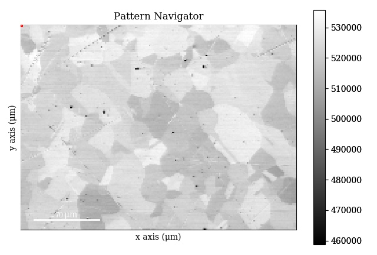

====================
Visualizing patterns
====================

The :py:class:`~kikuchipy.signals.ebsd.EBSD` object has a powerful and versatile
:py:meth:`~hyperspy.signal.BaseSignal.plot` method provided by HyperSpy, and its
uses are greatly detailed in the `HyperSpy user guide
<http://hyperspy.org/hyperspy-doc/current/user_guide/visualisation.html>`_. This
section details example uses specific to
:py:class:`~kikuchipy.signals.ebsd.EBSD` objects.

.. note::

    The Nickel data set used in this section can be downloaded from [Anes2019]_.

.. _navigate-in-custom-map:

Navigate in custom map
======================

Correlating results from e.g. crystal and phase structure determination, i.e.
indexing, with experimental patterns can inform their interpretation. When
calling :py:meth:`~hyperspy.signal.BaseSignal.plot` without any input
parameters, the navigator map is a grey scale image with pixel values
corresponding to the sum of all detector intensities within that pattern:

.. code-block:: python

    >>> s.plot()

.. _fig-standard-navigator:

    Example of a standard navigator map.

However, any :py:class:`~hyperspy.signal.BaseSignal` object with a
two-dimensional ``signal_shape`` corresponding to the scan ``navigation_shape``
can be passed in to the ``navgiator`` parameter, including a virtual image
showing compositional contrast, any quality metric map, or an orientation map or
a phase map.

.. _navigate-in-virtual-image:

Virtual image
-------------

A virtual image created from any custom aperture with the
:py:meth:`~kikuchipy.signals.ebsd.EBSD.get_virtual_image` method, explained in
the :doc:`virtual_forward_scatter_detector` (VFSD) section, can be used as a
navigator for a scan ``s``:

.. code-block:: python

    >>> import hyperspy.api as hs
    >>> roi = hs.roi.RectangularROI(left=18, top=20, right=23, bottom=25)
    >>> vfsd = s.get_virtual_image(roi)
    >>> s
    <EBSD, title: Pattern_c, dimensions: (200, 149|60, 60)>
    >>> vfsd
    <EBSD, title: Virtual Dark Field, dimensions: (|200, 149)>
    >>> s.plot(navigator=vfsd)

.. _fig-vfsd-navigator:

.. figure:: _static/image/visualizing_patterns/roi_vfsd_navigator.jpg
    :align: center
    :width: 100%

    Navigator map ``vfsd`` (left) with pixel values corresponding to the sum
    of the intensities within the rectangular, green aperture (``roi``) in the
    pattern (right).

.. _image-map:

Any image
---------

Images loaded into a :py:class:`~hyperspy.signals.Signal2D` can be used as
navigators. E.g. a quality metric map, like the orientation similarity obtained
from dictionary indexing with `EMsoft <https://github.com/EMsoft-org/EMsoft>`_
(see e.g. [Marquardt2017]_):

.. code-block:: python

    >>> import matplotlib.pyplot as plt
    >>> osm = plt.imread(os.path.join(datadir, '../emsoft/orig/quality_osm.png'))
    >>> s_osm = hs.signals.Signal2D(osm)
    >>> s_osm
    <Signal2D, title: , dimensions: (|2140, 1603)>
    >>> s_osm = s_osm.rebin(new_shape=s.axes_manager.navigation_shape)
    >>> s_osm
    <Signal2D, title: , dimensions: (|200, 149)>
    >>> s.plot(navigator=s_osm)

.. _fig-navigate-quality-metric:

.. figure:: _static/image/visualizing_patterns/osm_navigator.jpg
    :align: center
    :scale: 70%

    A quality metric map ``s_osm``, in this case an orientation similarity map
    from dictionary indexing with EMsoft, as navigator map.

Using colour images, e.g. an orientation or phase map, is a bit more involved:

.. code-block:: python

.. _plot-multiple-scans:

Plot multiple scans
===================
