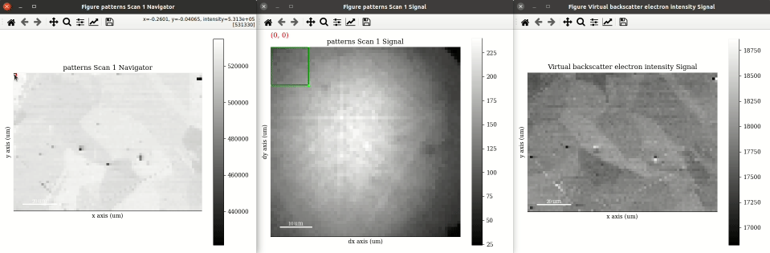
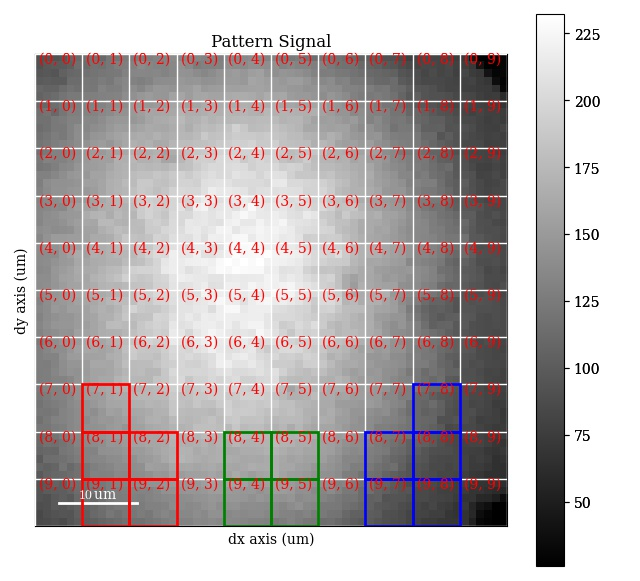
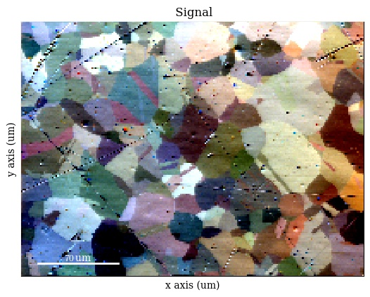
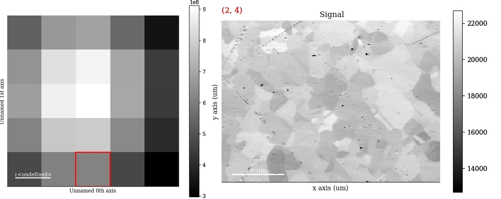

====================================
Virtual backscatter electron imaging
====================================

.. _interactive-plotting:

Interactive plotting
====================

Angle resolved backscatter electron (BSE) imaging can be performed interactively
with the method :meth:`~kikuchipy.signals.EBSD.plot_virtual_bse_intensity`,
adopted from pyxem_, by integrating the intensities within a part, e.g. a (10 x
10) pixel rectangular region of interest (ROI), of the stack of EBSD patterns:

.. _pyxem: http://github.com/pyxem/pyxem

.. code-block:: python

    >>> import hyperspy.api as hs
    >>> roi = hs.roi.RectangularROI(left=0, top=0, right=10, bottom=10)
    >>> roi
    RectangularROI(left=0, top=0, right=10, bottom=10)
    >>> s.plot_virtual_bse_intensity(roi)
    >>> roi
    RectangularROI(left=25, top=42, right=30, bottom=47)

.. _fig-virtual-backscatter-electron-imaging:

    Interactive virtual backscatter electron imaging.

Note that the position of the ROI on the detector is updated during the
interactive plotting. See `HyperSpy's ROI user guide
<http://hyperspy.org/hyperspy-doc/current/user_guide/interactive_operations_ROIs.html#region-of-interest-roi>`_
for more detailed use of these.

The virtual image, created from integrating the intensities within the ROI, can
then be written to an image file using
:meth:`~kikuchipy.signals.EBSD.get_virtual_bse_intensity`:

.. code-block:: python

    >>> import matplotlib.pyplot as plt
    >>> vbse = s.get_virtual_bse_intensity(roi)
    >>> vbse
    <VirtualBSEImage, title: Virtual backscatter electron image, dimensions: (|200, 149)>
    >>> plt.imsave(fname='/path/to/virtual_image.png', arr=vbse.data)

A :class:`~kikuchipy.signals.VirtualBSEImage` object is returned.

.. _generate-many-images:

Generate many virtual images
============================

Sometimes we want to get many images from parts of the detector, e.g. like what
is demonstrated in the `xcdskd project
<https://xcdskd.readthedocs.io/en/latest/bse_imaging.html>`_ with the angle
resolved virtual backscatter electron array (arbse/vbse array). Instead of
keeping track of multiple :class:`hyperspy.roi.BaseInteractiveROI` objects, we
can create a detector grid of a certain shape, e.g. (5, 5), and obtain gray
scale images, or combine multiple grid tiles in red, green and channels to
obtain RGB images.

First, we initialize a virtual BSE image generator
:class:`~kikuchipy.generators.VirtualBSEGenerator` object with a
:class:`~kikuchipy.signals.EBSD` object, in this case the raw EBSD patterns
without any background correction or other processing:

.. code-block::

    >>> s
    <EBSD, title: Pattern, dimensions: (200, 149|60, 60)>
    >>> vbse_gen = kp.generators.VirtualBSEGenerator(s)
    >>> vbse_gen
    VirtualBSEGenerator for <EBSD, title: Pattern, dimensions: (200, 149|60, 60)>

We can set and plot the detector grid on one of the EBSD patterns, also coloring
one or more of the grid tiles red, green and blue, as is done in [Nolze2017]_,
by calling :meth:`~kikuchipy.generators.VirtualBSEGenerator.plot_grid`:

.. [Nolze2017] G. Nolze, R. Hielscher, A. Winkelmann, "Electron backscatter \
    diffraction beyond the mainstream," *Crystal Research and Technology*
    **52(1)** (2017), doi: https://doi.org/10.1002/crat.201600252.

.. code-block::

    >>> vbse_gen.grid_shape
    (5, 5)
    >>> vbse_gen.grid_shape = (10, 10)
    >>> red = [(7, 1), (8, 1), (8, 2), (9, 1), (9, 2)]
    >>> green = [(8, 4), (8, 5), (9, 4), (9, 5)]
    >>> blue = [(7, 8), (8, 7), (8, 8), (9, 7), (9, 8)]
    >>> p = vbse_gen.plot_grid(
    ...     rgb_channels=[red, green, blue],
    ...     visible_indices=True,  # Default
    ...     pattern_idx=(100, 87),  # Default is (0, 0)
    ... )
    >>> p
    <EBSD, title: Pattern, dimensions: (|60, 60)>

As shown above, whether to show the grid tile indices or not is controlled with
the ``visible_indices`` argument, and which signal pattern to superimpose the
grid upon is controlled with the ``pattern_idx`` parameter.

    Detector grid tiles, with tiles to be used for creating an RGB image colored
    red, green and blue.

To obtain an RGB image from the detector grid tiles shown above, we use
:meth:`~kikuchipy.generators.VirtualBSEGenerator.get_rgb_image` (see the
docstring for all available parameters):

.. code-block::

    >>> vbse_rgb_img = vbse_gen.get_rgb_image(r=red, g=green, b=blue)
    >>> vbse_rgb_img
    <VirtualBSEImage, title: , dimensions: (|200, 149)>
    >>> vbse_rgb_img.plot()

    An RGB image formed from coloring three grey scale virtual BSE images red,
    green and blue.

To obtain one grey scale virtual BSE image from each grid tile, we use
:meth:`~kikuchipy.generators.VirtualBSEGenerator.get_images_from_grid`:

.. code-block::

    >>> vbse_imgs = vbse_gen.get_images_from_grid()
    >>> vbse_imgs
    <VirtualBSEImage, title: , dimensions: (5, 5|200, 149)>
    >>> vbse_imgs.plot()

    25 grey scale virtual BSE images, one from each tile in a (5, 5) detector
    grid.

It might be desirable to normalize or scale the intensities in the images, as
shown e.g. in Fig. 9 in [Wright2015b]_. This can be done with
:meth:`~kikuchipy.signals.VirtualBSEImage.rescale_intensity` or
:meth:`~kikuchipy.signals.VirtualBSEImage.normalize_intensity`:

.. [Wright2015b] S. I. Wright, M. M. Nowell, R. De Kloe, P. Camus, T. Rampton, \
    "Electron imaging with an EBSD detector," *Ultramicroscopy* **148** (2015),
    doi: http://dx.doi.org/10.1016/j.ultramic.2014.10.002.

.. code-block::

    >>> vbse_imgs.data.dtype
    dtype('float32')
    >>> print(vbse_imgs.data.min(), vbse_imgs.data.max())
    5629.0 31810.0
    >>> vbse_imgs.rescale_intensity()
    Rescaling the image intensities:
    [########################################] | 100% Completed |  0.3s
    >>> print(vbse_imgs.data.min(), vbse_imgs.data.max())
    -1.0 1.0

To obtain a rectangular ROI from the grid, we can use
:meth:`~kikuchipy.generators.VirtualBSEGenerator.roi_from_grid`:

.. code-block::

    >>> roi = vbse_gen.roi_from_grid((3, 3))  # (Row, column)
    >>> roi
    RectangularROI(left=18, top=18, right=24, bottom=24)
