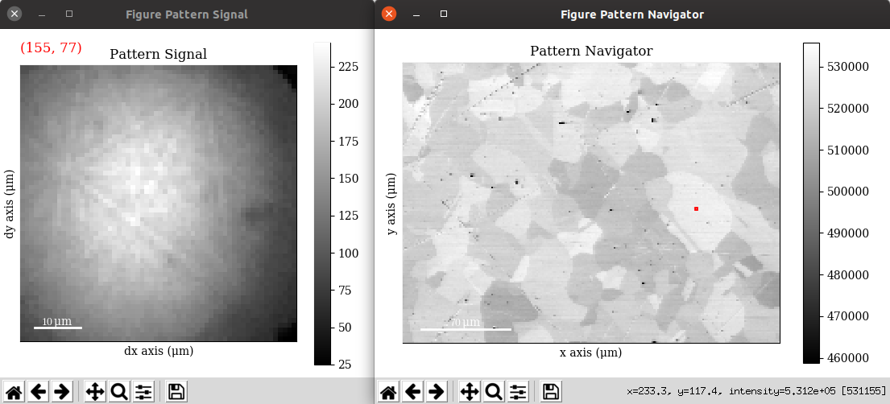
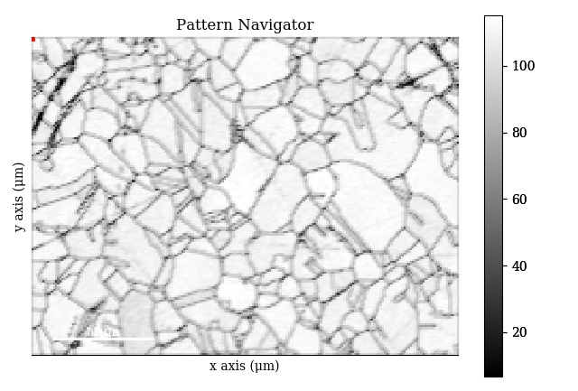
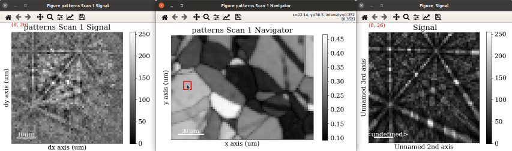

====================
Visualizing patterns
====================

The :class:`~kikuchipy.signals.ebsd.EBSD` object has a powerful and versatile
:meth:`~hyperspy.signal.BaseSignal.plot` method provided by HyperSpy, and its
uses are greatly detailed in HyperSpy's `visualisation user guide
<http://hyperspy.org/hyperspy-doc/current/user_guide/visualisation.html>`_. This
section details example uses specific to
:class:`~kikuchipy.signals.ebsd.EBSD` objects.

.. note::

    The Nickel data set used in this section can be downloaded from [Anes2019]_.

.. _navigate-in-custom-map:

Navigate in custom map
======================

Correlating results from e.g. crystal and phase structure determination, i.e.
indexing, with experimental patterns can inform their interpretation. When
calling :meth:`~hyperspy.signal.BaseSignal.plot` without any input
parameters, the navigator map is a grey scale image with pixel values
corresponding to the sum of all detector intensities within that pattern:

.. code-block:: python

    >>> s.plot()

.. _fig-standard-navigator:

    Example of a standard navigator map (right), and the detector (right). This
    is the standard view when calling ``s.plot()``.

However, any :class:`~hyperspy.signal.BaseSignal` object with a
two-dimensional ``signal_shape`` corresponding to the scan ``navigation_shape``
can be passed in to the ``navgiator`` parameter in
:meth:`~hyperspy.signal.BaseSignal.plot`, including a virtual image showing
diffraction contrast, any quality metric map, or an orientation map or a phase
map.

.. _navigate-in-virtual-image:

Virtual image
-------------

A virtual backscatter electron (VBSE) image created from any detector region of
interest with the :meth:`~kikuchipy.signals.ebsd.EBSD.get_virtual_image`
method, explained in the :doc:`virtual_backscatter_electron_imaging` section,
can be used as a navigator for a scan ``s``:

.. code-block:: python

    >>> import hyperspy.api as hs
    >>> roi = hs.roi.RectangularROI(left=18, top=20, right=23, bottom=25)
    >>> vbse = s.get_virtual_image(roi)
    >>> s
    <EBSD, title: Pattern_c, dimensions: (200, 149|60, 60)>
    >>> vbse
    <EBSD, title: Virtual Dark Field, dimensions: (|200, 149)>
    >>> s.plot(navigator=vbse)

.. _fig-vbse-navigator:

.. figure:: _static/image/visualizing_patterns/roi_vbse_navigator.jpg
    :align: center
    :width: 100%

    Navigator map ``vbse`` (left) with pixel values corresponding to the sum
    of the intensities within the rectangular, green aperture (``roi``) in the
    pattern (right).

.. _image-map:

Any image
---------

Images loaded into a :class:`~hyperspy.signals.Signal2D` object can be used as
navigators. E.g. a quality metric map, like the orientation similarity obtained
from dictionary indexing with `EMsoft <https://github.com/EMsoft-org/EMsoft>`_
(see e.g. [Marquardt2017]_):

.. code-block:: python

    >>> import matplotlib.pyplot as plt
    >>> import hyperspy.api as hs
    >>> osm = plt.imread('path/to/orientation_similarity_map.png'))
    >>> s_osm = hs.signals.Signal2D(osm)
    >>> s_osm
    <Signal2D, title: , dimensions: (|2140, 1603)>
    >>> s_osm = s_osm.rebin(new_shape=s.axes_manager.navigation_shape)
    >>> s_osm
    <Signal2D, title: , dimensions: (|200, 149)>
    >>> s.plot(navigator=s_osm)

.. _fig-navigate-quality-metric:

    A quality metric map ``s_osm``, in this case an orientation similarity map
    from dictionary indexing with EMsoft, as navigator map.

Using colour images, e.g. an orientation ``om`` or phase map, is a bit more
involved:

.. code-block:: python

    >>> om = plt.imread('/path/to/orientation_map.jpg')
    >>> om_scaled = ske.rescale_intensity(om, out_range=np.uint8)
    >>> s_om = hs.signals.Signal2D(om_scaled)
    >>> s_om
    <Signal2D, title: , dimensions: (149|3, 200)>
    >>> s_om = s_om.transpose(signal_axes=1)
    >>> print(s_om, s_om.data.dtype)
    <Signal1D, title: , dimensions: (200, 149|3)> uint8
    >>> s_om.change_dtype('rgb8')
    >>> s_om
    <Signal2D, title: , dimensions: (|200, 149)> [('R', 'u1'), ('G', 'u1'), ('B', 'u1')]
    >>> s.plot(navigator=s_om)

.. _fig-orientation-map-navigator:

.. figure:: _static/image/visualizing_patterns/orientation_map_navigator.jpg
    :align: center
    :width: 450

    An orientation map ``s_om`` as a navigator map.

.. _plot-multiple-scans:

Plot multiple scans
===================

HyperSpy provides the function :func:`~hyperspy.misc.utils.plot_signals` to plot
multiple signals with the same navigator, as explained in the `HyperSpy user
guide <http://hyperspy.org/hyperspy-doc/current/user_guide/visualisation.html#plotting-several-signals>`_.
This enables e.g. plotting of experimental and simulated patterns side by side
as a visual inspection of the indexing results:

.. code-block:: python

    >>> import hyperspy.api as hs
    >>> import h5py
    >>> with h5py.File('/path/to/simulated_patterns/sim.h5', mode='r') as f:
            patterns = f['EMData/EBSD/EBSDPatterns'][()]
    >>> s_sim = kp.signals.EBSD(patterns.reshape(s.axes_manager.shape))
    >>> hs.plot.plot_signals([s, s_sim])

.. _fig-plot-multiple-scans:

    Plotting of experimental and simulated patterns side by side for visual
    inspection, using an :ref:`orientation map as navigator
    <fig-orientation-map-navigator>`.
